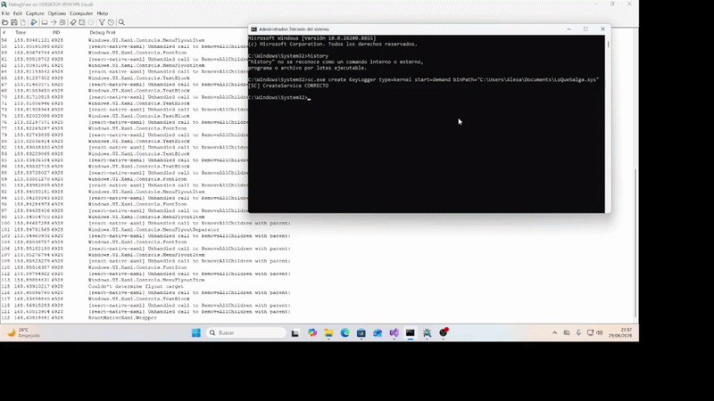

# Windows Kernel Driver Development

Guía de referencia para desarrollo de drivers de kernel Windows (.sys) con WDK.

---

## Índice

1. [Entorno de desarrollo](#entorno-de-desarrollo)
2. [Estructura de un driver](#estructura-de-un-driver)
3. [Compilación](#compilación)
4. [Carga y descarga del driver](#carga-y-descarga-del-driver)
5. [Depuración](#depuración)
6. [Conceptos clave](#conceptos-clave)
7. [Tipos de drivers](#tipos-de-drivers)
8. [Headers comunes](#headers-comunes)
9. [Ejemplo completo — Filtro de teclado](#ejemplo-completo--filtro-de-teclado)
10. [Recursos](#recursos)

---

## Entorno de desarrollo

### Requisitos

- Windows 10/11 (host)
- [Visual Studio 2022](https://visualstudio.microsoft.com/) — con el workload *Desktop development with C++*
- [Windows Driver Kit (WDK)](https://learn.microsoft.com/en-us/windows-hardware/drivers/download-the-wdk) — misma versión que el Windows SDK
- [VirtualBox](https://www.virtualbox.org/) o VMware — para pruebas seguras (evitar BSODs en el host)
- [DebugView++](https://github.com/CobaltFusion/DebugViewPP) — para ver mensajes `KdPrint` sin WinDbg
- [OSR Driver Loader](https://www.osronline.com/article.cfm%5Earticle=157.htm) — para cargar `.sys` durante desarrollo sin INF

### Configurar la VM de pruebas

Dentro de la máquina virtual, ejecutar **como administrador**:

```cmd
:: Habilitar modo test signing (permite cargar drivers sin firma oficial)
bcdedit /set testsigning on

:: Habilitar debug de kernel (opcional, para WinDbg)
bcdedit /set debug on

:: Reiniciar para aplicar
shutdown /r /t 0
```

> ⚠️ Hacer siempre las pruebas en la VM, nunca en el host.

---

## Estructura de un driver

Todo driver WDM mínimo necesita dos funciones obligatorias:

```c
#include <ntddk.h>

// 1. Descarga del driver — limpieza de recursos
VOID DriverUnload(PDRIVER_OBJECT DriverObject) {
    UNREFERENCED_PARAMETER(DriverObject);
    KdPrint(("MiDriver: Descargado\n"));
}

// 2. Punto de entrada — equivalente al main()
NTSTATUS DriverEntry(PDRIVER_OBJECT DriverObject, PUNICODE_STRING RegistryPath) {
    UNREFERENCED_PARAMETER(RegistryPath);

    DriverObject->DriverUnload = DriverUnload; // Siempre registrar Unload

    KdPrint(("MiDriver: Cargado\n"));
    return STATUS_SUCCESS;
}
```

### Esqueleto con device object y dispatch routines

```c
#include <ntddk.h>

#define DEVICE_NAME  L"\\Device\\MiDriver"
#define SYMLINK_NAME L"\\DosDevices\\MiDriver"

NTSTATUS DispatchCreateClose(PDEVICE_OBJECT DeviceObject, PIRP Irp) {
    UNREFERENCED_PARAMETER(DeviceObject);
    Irp->IoStatus.Status = STATUS_SUCCESS;
    Irp->IoStatus.Information = 0;
    IoCompleteRequest(Irp, IO_NO_INCREMENT);
    return STATUS_SUCCESS;
}

VOID DriverUnload(PDRIVER_OBJECT DriverObject) {
    UNICODE_STRING symLink = RTL_CONSTANT_STRING(SYMLINK_NAME);
    IoDeleteSymbolicLink(&symLink);
    IoDeleteDevice(DriverObject->DeviceObject);
    KdPrint(("MiDriver: Descargado\n"));
}

NTSTATUS DriverEntry(PDRIVER_OBJECT DriverObject, PUNICODE_STRING RegistryPath) {
    UNREFERENCED_PARAMETER(RegistryPath);
    NTSTATUS status;
    PDEVICE_OBJECT devObj = NULL;

    UNICODE_STRING devName  = RTL_CONSTANT_STRING(DEVICE_NAME);
    UNICODE_STRING symLink  = RTL_CONSTANT_STRING(SYMLINK_NAME);

    // Crear dispositivo
    status = IoCreateDevice(DriverObject, 0, &devName,
                            FILE_DEVICE_UNKNOWN, 0, FALSE, &devObj);
    if (!NT_SUCCESS(status)) return status;

    // Crear enlace simbólico (accesible desde userspace como \\.\MiDriver)
    status = IoCreateSymbolicLink(&symLink, &devName);
    if (!NT_SUCCESS(status)) {
        IoDeleteDevice(devObj);
        return status;
    }

    // Registrar handlers
    DriverObject->MajorFunction[IRP_MJ_CREATE] = DispatchCreateClose;
    DriverObject->MajorFunction[IRP_MJ_CLOSE]  = DispatchCreateClose;
    DriverObject->DriverUnload = DriverUnload;

    KdPrint(("MiDriver: Cargado\n"));
    return STATUS_SUCCESS;
}
```

---

## Compilación

### Crear proyecto en Visual Studio

1. `File → New → Project`
2. Buscar *Kernel Mode Driver (KMDF)* o *Empty WDM Driver*
3. Verificar en las propiedades del proyecto:

```xml
<ConfigurationType>Driver</ConfigurationType>
<TargetExt>.sys</TargetExt>
```

### Compilar desde línea de comandos

```cmd
:: Abrir "Developer Command Prompt for VS 2022"
msbuild MiDriver.vcxproj /p:Configuration=Debug /p:Platform=x64
```

El `.sys` generado estará en `x64\Debug\MiDriver.sys`.

---

## Carga y descarga del driver


```cmd
:: Registrar
sc.exe create MiDriver type=kernel binPath= "C:\ruta\MiDriver.sys"

:: Iniciar
sc.exe start MiDriver

:: Detener
sc.exe stop MiDriver

:: Eliminar
sc.exe delete MiDriver
```

## Depuración

### DebugView++ (más sencillo)

1. Ejecutar como administrador
2. `Capture → Capture Kernel` ✓
3. `Capture -> Enable Verbose Kernel Output` ✓
4. Los mensajes `KdPrint(("texto\n"))` aparecen en tiempo real


### Códigos de error comunes

| Código | Significado |
|--------|-------------|
| `0xC0000034` | Driver no encontrado en la ruta indicada |
| `0xC000010E` | Driver ya está cargado |
| `0xC0000428` | Firma digital inválida (falta testsigning) |
| `0x0000007E` | BSOD — normalmente null pointer en el driver |
| `0xC0000005` | Access violation en kernel |

---

## Conceptos clave

### IRQL (Interrupt Request Level)

El kernel ejecuta código en diferentes niveles de prioridad. Es crítico conocerlos:

| IRQL | Nombre | Qué puedes hacer |
|------|--------|-----------------|
| 0 | `PASSIVE_LEVEL` | Todo. Llamadas a userspace, I/O, sleep |
| 1 | `APC_LEVEL` | Casi todo, sin APCs de usuario |
| 2 | `DISPATCH_LEVEL` | Solo memoria no paginada, sin esperas |
| 3+ | `DIRQL` | Handlers de interrupciones hardware |

> ⚠️ En `DISPATCH_LEVEL` o superior **nunca** usar memoria paginada ni funciones que puedan hacer wait.

### Tipos de memoria del pool

```c
// No paginada — siempre en RAM, usable a cualquier IRQL
PVOID buf = ExAllocatePoolWithTag(NonPagedPool, size, 'MiDr');

// Paginada — puede ir a disco, solo PASSIVE_LEVEL / APC_LEVEL
PVOID buf = ExAllocatePoolWithTag(PagedPool, size, 'MiDr');

// Liberar siempre
ExFreePoolWithTag(buf, 'MiDr');
```

### IRPs (I/O Request Packets)

Son la unidad de comunicación entre capas del kernel:

```c
// Completar un IRP correctamente
Irp->IoStatus.Status      = STATUS_SUCCESS;
Irp->IoStatus.Information = bytesTransferred;
IoCompleteRequest(Irp, IO_NO_INCREMENT);
return STATUS_SUCCESS;
```

### Sincronización

```c
// Mutex del kernel
FAST_MUTEX mutex;
ExInitializeFastMutex(&mutex);
ExAcquireFastMutex(&mutex);
// sección crítica
ExReleaseFastMutex(&mutex);

// Spinlock (para DISPATCH_LEVEL)
KSPIN_LOCK spinLock;
KIRQL oldIrql;
KeInitializeSpinLock(&spinLock);
KeAcquireSpinLock(&spinLock, &oldIrql);
// sección crítica
KeReleaseSpinLock(&spinLock, oldIrql);
```

---

## Tipos de drivers

| Tipo | Uso típico | Framework |
|------|-----------|-----------|
| WDM | Control total, bajo nivel | WDM (manual) |
| WDF/KMDF | Hardware general, más sencillo | KMDF |
| Minifilter | Interceptar I/O de archivos | Filter Manager |
| NDIS | Drivers de red | NDIS |
| Bus Driver | Enumerar dispositivos (USB hub, PCI) | WDM/KMDF |
| Filter Driver | Capa sobre otro driver existente | WDM |

---

## Headers comunes

```c
#include <ntddk.h>       // Base de cualquier driver — siempre incluir
#include <wdm.h>         // Alternativa a ntddk, más bajo nivel
#include <wdf.h>         // Si usas KMDF en vez de WDM puro

// Por área de desarrollo:
#include <usbdi.h>       // USB
#include <usbiodef.h>    // GUIDs de interfaces USB
#include <hidport.h>     // HID (teclados, ratones, gamepads)
#include <fltKernel.h>   // Minifilters — interceptar operaciones de archivo
#include <ntifs.h>       // File system drivers
#include <ndis.h>        // Network drivers
#include <wdmsec.h>      // Seguridad en device objects
#include <initguid.h>    // Definir GUIDs con DEFINE_GUID
```

---

## Ejemplo completo — Filtro de teclado

Un filtro de teclado es un driver WDM que se inserta en la pila de dispositivos encima de `kbdclass.sys`. Intercepta todos los IRPs de lectura antes de que lleguen a Windows, permitiendo leer, modificar o bloquear cualquier tecla.

Referencias:
- [kbfiltr sample — Microsoft](https://github.com/microsoft/Windows-driver-samples/blob/main/input/kbfiltr/sys/kbfiltr.c)
- [Keyboard and Mouse HID client drivers](https://learn.microsoft.com/es-es/windows-hardware/drivers/hid/keyboard-and-mouse-hid-client-drivers)
- [IOCTL_INTERNAL_KEYBOARD_CONNECT](https://learn.microsoft.com/es-es/windows-hardware/drivers/ddi/kbdmou/ni-kbdmou-ioctl_internal_keyboard_connect)

Elegí desarrollar un filtro de teclado porque permite explorar el funcionamiento de los IRPs de lectura, la pila de dispositivos y la estructura KEYBOARD_INPUT_DATA, que son conceptos fundamentales del modelo de drivers WDM.

Entorno usado:

- Máquina virtual Windows 11
- Test Signing habilitado
- Driver cargado mediante sc.exe
- Depuración mediante DebugView++

### Cómo funciona la pila

Sin el filtro, la ruta de una tecla es:

```
Hardware → kbdclass.sys → Win32k.sys → Aplicación
```

Al cargar el filtro, el driver se inserta encima de kbdclass con `IoAttachDevice`:

```
Hardware → kbdclass.sys → [TU DRIVER] → Win32k.sys → Aplicación
```

Cada tecla pulsada genera un IRP que sube por la pila. Tu driver lo recibe primero, lo pasa a kbdclass, y cuando kbdclass lo rellena con los datos reales, el kernel llama a tu completion routine.

### Ciclo de vida de un IRP de teclado

```
1. Hardware genera interrupción
2. Kernel crea IRP_MJ_READ → llama a DispatchRead (tu driver)
3. DispatchRead registra ReadComplete y pasa el IRP a kbdclass con IoCallDriver
4. kbdclass lee el hardware y rellena el buffer con KEYBOARD_INPUT_DATA
5. Kernel llama a ReadComplete (tu driver)
6. ReadComplete lee MakeCode y Flags → DbgPrint → devuelve STATUS_CONTINUE_COMPLETION
7. IRP sube hacia Win32k
```

El driver es un **autómata reactivo**: no tiene bucle propio. El I/O Manager del kernel actúa como despachador de eventos; el driver solo reacciona a los IRPs que recibe.

### Headers necesarios

```c
#include <ntddk.h>   // Base del kernel: NTSTATUS, PIRP, IoCreateDevice, DbgPrint...
#include <kbdmou.h>  // Tipos de teclado: PKEYBOARD_INPUT_DATA, KEY_BREAK, KEY_MAKE
```

> `kbdmou.h` se encuentra en `C:\Program Files (x86)\Windows Kits\10\Include\<version>\km\`.
> Verificar que esa ruta esté en *Project Properties → C/C++ → Additional Include Directories*.

### Variables globales

```c
PDEVICE_OBJECT gFilterDevice = NULL;  // Nuestro dispositivo (creado con IoCreateDevice)
PDEVICE_OBJECT gNextDevice   = NULL;  // kbdclass.sys (obtenido con IoAttachDevice)
```

Ambas empiezan en `NULL` y se rellenan en `DriverEntry`. `gNextDevice` es imprescindible: sin él `IoCallDriver` recibe `NULL` y provoca BSOD inmediato.

### DriverEntry

`DriverEntry` es el constructor del driver. Se ejecuta una sola vez al cargar el `.sys` y debe terminar rápido — no hay bucle, no hay espera.

```c
NTSTATUS DriverEntry(PDRIVER_OBJECT pDriverObj, PUNICODE_STRING pRegistryPath) {
    UNREFERENCED_PARAMETER(pRegistryPath);
    NTSTATUS status;

    // 1. Crear nuestro dispositivo filtro
    status = IoCreateDevice(
        pDriverObj,           // driver propietario
        0,                    // sin device extension
        NULL,                 // sin nombre (no necesita ser abierto directamente)
        FILE_DEVICE_KEYBOARD, // tipo: teclado — debe coincidir con kbdclass
        0,                    // sin características extra
        FALSE,                // no exclusivo
        &gFilterDevice        // OUT: puntero al objeto creado
    );
    if (!NT_SUCCESS(status)) {
        DbgPrint("IoCreateDevice fallo: 0x%X\n", status);
        return status;
    }

    // 2. Adjuntarse encima de kbdclass en la pila
    UNICODE_STRING kbdName;
    RtlInitUnicodeString(&kbdName, L"\\Device\\KeyboardClass0");

    status = IoAttachDevice(gFilterDevice, &kbdName, &gNextDevice);
    if (!NT_SUCCESS(status)) {
        DbgPrint("IoAttachDevice fallo: 0x%X\n", status);
        IoDeleteDevice(gFilterDevice); // limpiar para no dejar objeto huérfano
        return status;
    }

    // 3. Sincronizar flags con el dispositivo inferior
    //    Si no se copian, el kernel puede rechazar los IRPs o leer buffers incorrectos
    gFilterDevice->DeviceType      = gNextDevice->DeviceType;
    gFilterDevice->Characteristics = gNextDevice->Characteristics;
    gFilterDevice->StackSize       = gNextDevice->StackSize + 1; // +1 por nuestro nivel
    gFilterDevice->Flags          |= gNextDevice->Flags & (DO_BUFFERED_IO | DO_DIRECT_IO);
    gFilterDevice->Flags          &= ~DO_DEVICE_INITIALIZING; // obligatorio al terminar init

    // 4. Registrar callbacks
    pDriverObj->MajorFunction[IRP_MJ_READ] = DispatchRead;
    pDriverObj->DriverUnload               = Unload;

    DbgPrint("Filtro cargado y adjuntado a KeyboardClass0\n");
    return STATUS_SUCCESS;
}
```

**Por qué se copian los flags:**

| Flag | Propósito |
|------|-----------|
| `DeviceType` | La pila exige que todos los niveles sean del mismo tipo |
| `StackSize` | Determina cuántos stack locations se reservan por IRP. Si es insuficiente, se acaban al pasar IRPs |
| `DO_BUFFERED_IO / DO_DIRECT_IO` | Define cómo el kernel mapea el buffer en memoria. Si difiere del dispositivo inferior, los punteros apuntan a basura |
| `DO_DEVICE_INITIALIZING` | El kernel lo activa en `IoCreateDevice`. Mientras esté activo, rechaza IRPs. Hay que quitarlo explícitamente |

### DispatchRead

Se llama cada vez que el sistema genera un `IRP_MJ_READ` para el teclado — es decir, en cada pulsación o suelta de tecla. En este punto el buffer está vacío: kbdclass aún no ha leído el hardware.

```c
NTSTATUS DispatchRead(PDEVICE_OBJECT DevObj, PIRP Irp) {
    UNREFERENCED_PARAMETER(DevObj);

    // Copiar el stack location actual al siguiente nivel
    // Sin esto, kbdclass no sabe qué operación ejecutar
    IoCopyCurrentIrpStackLocationToNext(Irp);

    // Registrar la completion routine para cuando kbdclass termine
    IoSetCompletionRoutine(
        Irp,
        ReadComplete, // función a llamar al completar
        NULL,         // contexto opcional (no necesario aquí)
        TRUE,         // llamar si éxito
        TRUE,         // llamar si error
        TRUE          // llamar si cancelado
    );

    // Pasar el IRP a kbdclass
    // El kernel llamará a ReadComplete cuando kbdclass lo complete
    return IoCallDriver(gNextDevice, Irp);
}
```

### ReadComplete

El kernel la llama automáticamente cuando kbdclass ha terminado de leer la tecla. Aquí el buffer ya contiene datos reales.

```c
NTSTATUS ReadComplete(PDEVICE_OBJECT DevObj, PIRP Irp, PVOID Context) {
    UNREFERENCED_PARAMETER(DevObj);
    UNREFERENCED_PARAMETER(Context);

    // Regla obligatoria: si el IRP venía marcado como pendiente,
    // hay que propagarlo. Si no, el kernel detecta inconsistencia → BSOD
    if (Irp->PendingReturned)
        IoMarkIrpPending(Irp);

    // Verificar que la lectura fue exitosa y que hay datos en el buffer
    // Sin este guard se leería memoria no inicializada → BSOD
    if (NT_SUCCESS(Irp->IoStatus.Status) && Irp->IoStatus.Information > 0) {

        PKEYBOARD_INPUT_DATA keys =
            (PKEYBOARD_INPUT_DATA)Irp->AssociatedIrp.SystemBuffer;
        // SystemBuffer apunta al buffer rellenado por kbdclass
        // KEYBOARD_INPUT_DATA contiene:
        //   MakeCode — scancode de la tecla (ej: 0x1E = 'A')
        //   Flags    — KEY_MAKE (pulsada) o KEY_BREAK (soltada)

        DbgPrint("Tecla: 0x%X %s\n",
            keys->MakeCode,
            keys->Flags == KEY_BREAK ? "soltada" : "pulsada"
        );
    }

    // Dejar que el IRP continúe subiendo hacia Win32k
    // STATUS_MORE_PROCESSING_REQUIRED lo detendría aquí (requiere completarlo manualmente)
    return STATUS_CONTINUE_COMPLETION;
}
```

**Diferencia entre `STATUS_CONTINUE_COMPLETION` y `STATUS_MORE_PROCESSING_REQUIRED`:**

| Valor de retorno | Efecto |
|-----------------|--------|
| `STATUS_CONTINUE_COMPLETION` | El IRP sigue subiendo por la pila normalmente |
| `STATUS_MORE_PROCESSING_REQUIRED` | El IRP se detiene. El driver debe completarlo manualmente más tarde con `IoCompleteRequest` |

### Unload

Se llama al ejecutar `sc stop`. Debe limpiar en orden inverso a `DriverEntry`: primero salir de la pila, luego destruir el dispositivo. Invertir el orden provoca BSOD porque `IoDeleteDevice` liberaría memoria que la pila aún puede estar usando.

```c
VOID Unload(PDRIVER_OBJECT DriverObject) {
    UNREFERENCED_PARAMETER(DriverObject);

    // 1. Salir de la pila — a partir de aquí no llegan más IRPs
    if (gNextDevice)
        IoDetachDevice(gNextDevice);

    // 2. Destruir nuestro dispositivo — siempre después de IoDetachDevice
    if (gFilterDevice)
        IoDeleteDevice(gFilterDevice);

    DbgPrint("Driver descargado\n");
}
```

> ⚠️ Este Unload es funcional pero no maneja IRPs en vuelo. Si se ejecuta `sc stop` justo mientras un IRP está siendo procesado, puede producir BSOD. Para producción, añadir un contador de IRPs pendientes con `InterlockedIncrement/Decrement` y un `KEVENT` que bloquee el Unload hasta que todos los IRPs completen.

### Código completo

```c
// ref: https://github.com/microsoft/Windows-driver-samples/blob/main/input/kbfiltr/sys/kbfiltr.c

#include <ntddk.h>
#include <kbdmou.h>

NTSTATUS DispatchRead(PDEVICE_OBJECT DevObj, PIRP Irp);
NTSTATUS ReadComplete(PDEVICE_OBJECT DevObj, PIRP Irp, PVOID Context);
VOID     Unload(PDRIVER_OBJECT DriverObject);

PDEVICE_OBJECT gFilterDevice = NULL;
PDEVICE_OBJECT gNextDevice   = NULL;

NTSTATUS DriverEntry(PDRIVER_OBJECT pDriverObj, PUNICODE_STRING pRegistryPath) {
    UNREFERENCED_PARAMETER(pRegistryPath);
    NTSTATUS status;

    status = IoCreateDevice(pDriverObj, 0, NULL,
                            FILE_DEVICE_KEYBOARD, 0, FALSE, &gFilterDevice);
    if (!NT_SUCCESS(status)) {
        DbgPrint("IoCreateDevice fallo: 0x%X\n", status);
        return status;
    }

    UNICODE_STRING kbdName;
    RtlInitUnicodeString(&kbdName, L"\\Device\\KeyboardClass0");

    status = IoAttachDevice(gFilterDevice, &kbdName, &gNextDevice);
    if (!NT_SUCCESS(status)) {
        DbgPrint("IoAttachDevice fallo: 0x%X\n", status);
        IoDeleteDevice(gFilterDevice);
        return status;
    }

    gFilterDevice->DeviceType      = gNextDevice->DeviceType;
    gFilterDevice->Characteristics = gNextDevice->Characteristics;
    gFilterDevice->StackSize       = gNextDevice->StackSize + 1;
    gFilterDevice->Flags          |= gNextDevice->Flags & (DO_BUFFERED_IO | DO_DIRECT_IO);
    gFilterDevice->Flags          &= ~DO_DEVICE_INITIALIZING;

    pDriverObj->MajorFunction[IRP_MJ_READ] = DispatchRead;
    pDriverObj->DriverUnload               = Unload;

    DbgPrint("Filtro cargado y adjuntado a KeyboardClass0\n");
    return STATUS_SUCCESS;
}

NTSTATUS DispatchRead(PDEVICE_OBJECT DevObj, PIRP Irp) {
    UNREFERENCED_PARAMETER(DevObj);
    IoCopyCurrentIrpStackLocationToNext(Irp);
    IoSetCompletionRoutine(Irp, ReadComplete, NULL, TRUE, TRUE, TRUE);
    return IoCallDriver(gNextDevice, Irp);
}

NTSTATUS ReadComplete(PDEVICE_OBJECT DevObj, PIRP Irp, PVOID Context) {
    UNREFERENCED_PARAMETER(DevObj);
    UNREFERENCED_PARAMETER(Context);

    if (Irp->PendingReturned)
        IoMarkIrpPending(Irp);

    if (NT_SUCCESS(Irp->IoStatus.Status) && Irp->IoStatus.Information > 0) {
        PKEYBOARD_INPUT_DATA keys =
            (PKEYBOARD_INPUT_DATA)Irp->AssociatedIrp.SystemBuffer;
        DbgPrint("Tecla: 0x%X %s\n",
            keys->MakeCode,
            keys->Flags == KEY_BREAK ? "soltada" : "pulsada");
    }

    return STATUS_CONTINUE_COMPLETION;
}

VOID Unload(PDRIVER_OBJECT DriverObject) {
    UNREFERENCED_PARAMETER(DriverObject);
    if (gNextDevice)   IoDetachDevice(gNextDevice);
    if (gFilterDevice) IoDeleteDevice(gFilterDevice);
    DbgPrint("Driver descargado\n");
}
```
---



---

## Recursos

### Documentación oficial

- [Windows Driver Kit Docs](https://learn.microsoft.com/en-us/windows-hardware/drivers/) — referencia completa
- [DDI Reference](https://learn.microsoft.com/en-us/windows-hardware/drivers/ddi/) — cada función del kernel documentada
- [Windows-driver-samples](https://github.com/microsoft/Windows-driver-samples) — ejemplos oficiales de Microsoft


### Headers del WDK (referencia local)

Cuando la documentación no es suficiente, los propios headers tienen comentarios útiles:

```
C:\Program Files (x86)\Windows Kits\10\Include\<version>\km\
```

### Ejemplos de las librerias usadas:
C:\Program Files (x86)\Windows Kits\10\Include\10.0.26100.0\km\ntddk.h
C:\Program Files (x86)\Windows Kits\10\Include\10.0.26100.0\km\kbdmou.h

Se pondrá el de kbdmou por ser más pequeño, esot es como ejemplo

```
/*++

Copyright (c) 1989  Microsoft Corporation

Module Name:

    kbdmou.h

Abstract:

    These are the structures and defines that are used in the
    keyboard class driver, mouse class driver, and keyboard/mouse port
    driver.

Author:

    lees

Revision History:

--*/

#ifndef _KBDMOU_
#define _KBDMOU_

#include <ntddkbd.h>
#include <ntddmou.h>

//
// Define the keyboard/mouse port device name strings.
//

#define DD_KEYBOARD_PORT_DEVICE_NAME    "\\Device\\KeyboardPort"
#define DD_KEYBOARD_PORT_DEVICE_NAME_U L"\\Device\\KeyboardPort"
#define DD_KEYBOARD_PORT_BASE_NAME_U   L"KeyboardPort"
#define DD_POINTER_PORT_DEVICE_NAME     "\\Device\\PointerPort"
#define DD_POINTER_PORT_DEVICE_NAME_U  L"\\Device\\PointerPort"
#define DD_POINTER_PORT_BASE_NAME_U    L"PointerPort"

//
// Define the keyboard/mouse class device name strings.
//

#define DD_KEYBOARD_CLASS_BASE_NAME_U   L"KeyboardClass"
#define DD_POINTER_CLASS_BASE_NAME_U    L"PointerClass"

//
// Define the keyboard/mouse resource class names.
//

#define DD_KEYBOARD_RESOURCE_CLASS_NAME_U             L"Keyboard"
#define DD_POINTER_RESOURCE_CLASS_NAME_U              L"Pointer"
#define DD_KEYBOARD_MOUSE_COMBO_RESOURCE_CLASS_NAME_U L"Keyboard/Pointer"

//
// Define the maximum number of pointer/keyboard port names the port driver
// will use in an attempt to IoCreateDevice.
//

#define POINTER_PORTS_MAXIMUM  8
#define KEYBOARD_PORTS_MAXIMUM 8

//
// Define the port connection data structure.
//

typedef struct _CONNECT_DATA {
    IN PDEVICE_OBJECT ClassDeviceObject;
    IN PVOID ClassService;
} CONNECT_DATA, *PCONNECT_DATA;

//
// Define the service callback routine's structure.
//

typedef
VOID
(*PSERVICE_CALLBACK_ROUTINE) (
    _In_ PVOID NormalContext,
    _In_ PVOID SystemArgument1,
    _In_ PVOID SystemArgument2,
    _Inout_ PVOID SystemArgument3
    );

//
// WMI structures returned by port drivers
//
#include <wmidata.h>

//
// NtDeviceIoControlFile internal IoControlCode values for keyboard device.
//

#define IOCTL_INTERNAL_KEYBOARD_CONNECT CTL_CODE(FILE_DEVICE_KEYBOARD, 0x0080, METHOD_NEITHER, FILE_ANY_ACCESS)
#define IOCTL_INTERNAL_KEYBOARD_DISCONNECT CTL_CODE(FILE_DEVICE_KEYBOARD,0x0100, METHOD_NEITHER, FILE_ANY_ACCESS)
#define IOCTL_INTERNAL_KEYBOARD_ENABLE  CTL_CODE(FILE_DEVICE_KEYBOARD, 0x0200, METHOD_NEITHER, FILE_ANY_ACCESS)
#define IOCTL_INTERNAL_KEYBOARD_DISABLE CTL_CODE(FILE_DEVICE_KEYBOARD, 0x0400, METHOD_NEITHER, FILE_ANY_ACCESS)

//
// NtDeviceIoControlFile internal IoControlCode values for mouse device.
//


#define IOCTL_INTERNAL_MOUSE_CONNECT    CTL_CODE(FILE_DEVICE_MOUSE, 0x0080, METHOD_NEITHER, FILE_ANY_ACCESS)
#define IOCTL_INTERNAL_MOUSE_DISCONNECT CTL_CODE(FILE_DEVICE_MOUSE, 0x0100, METHOD_NEITHER, FILE_ANY_ACCESS)
#define IOCTL_INTERNAL_MOUSE_ENABLE     CTL_CODE(FILE_DEVICE_MOUSE, 0x0200, METHOD_NEITHER, FILE_ANY_ACCESS)
#define IOCTL_INTERNAL_MOUSE_DISABLE    CTL_CODE(FILE_DEVICE_MOUSE, 0x0400, METHOD_NEITHER, FILE_ANY_ACCESS)

//
// Error log definitions (specific to the keyboard/mouse) for DumpData[0]
// in the IO_ERROR_LOG_PACKET.
//
//     DumpData[1] <= hardware port/register
//     DumpData[2] <= {command byte || expected response byte}
//     DumpData[3] <= {command's parameter byte || actual response byte}
//
//

#define KBDMOU_COULD_NOT_SEND_COMMAND  0x0000
#define KBDMOU_COULD_NOT_SEND_PARAM    0x0001
#define KBDMOU_NO_RESPONSE             0x0002
#define KBDMOU_INCORRECT_RESPONSE      0x0004

//
// Define the base values for the error log packet's UniqueErrorValue field.
//

#define I8042_ERROR_VALUE_BASE        1000
#define INPORT_ERROR_VALUE_BASE       2000
#define SERIAL_MOUSE_ERROR_VALUE_BASE 3000

#endif // _KBDMOU_


```


---

> Cualquier prueba, siempre en VM. Un bug en kernel = BSOD instantáneo.